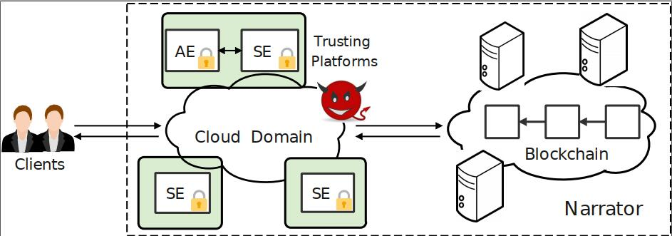

# Narrator: Secure and Practical State Continuity for Trusted Execution on Cloud
Thank you for your interest in Narrator. This document will get you started with our prototype implementation. If you have any problems, we will do our best to resolve them as soon as possible. 
Narrator is accepted by ACM CCS'22, see [list of accepted papers](https://www.sigsac.org/ccs/CCS2022/program/accepted-papers.html) for more details. You can download the paper [here]().


## Overview of the Narrator

Narrator is a performant distributed system, which contains $n = 2f + 1$ State Enclaves (SEs running on different SGX-enabled platforms. Each SE can provide state continuity service to all the Application Enclaves (AEs) on the same platform. To tolerate unexpected failures, Narrator adopts a customized version of the consistent broadcast protocol rather than complicated consensus protocols for state updates. You can download the paper [here]().


## Setting up Narrator
We have prepared an automated environment deployment script(init.sh) for Narrator. Please ensure your machine supports SGX. We chose AliCloud for our test environment. We choose the model ”ecs.c7t.xlarge” as an instance, this instance is equipped with 8GB RAM, a 4v CPU (Intel Xeon Platinum 8369B @ 3.5GHz), and 4GB EPC (Enclave Page Cache). 
Here is the detial for this instance. 
If you want to deploy your own environment, please refer to the following links on how to setup the DCAP Attestation Service in your environment:

- [Intel SGX DCAP Quick Install Guide](https://software.intel.com/content/www/us/en/develop/articles、intel-software-guard-extensions-data-center-attestation-primitives-quick-install-guide.html)
- [Setting up Open Enclave to use DCAP](https://github.com/openenclave/openenclave/blob/master/docs/GettingStartedDocs/Contributors/NonAccMachineSGXLinuxGettingStarted.md)
- [Attestation on OE SDK](https://github.com/openenclave/openenclave/blob/master/docs/DesignDocs/SGX_QuoteEx_Integration.md)
- [Configure OE SDK SGX on Linux in non-ACC Machines](https://github.com/openenclave/openenclave/blob/master/docs/GettingStartedDocs/Contributors/NonAccMachineSGXLinuxGettingStarted.md)
- [Intel® SGX Services for ECDSA Attestation ](https://api.portal.trustedservices.intel.com)

## Start Narrator
As overview says, Narrator include three parts, tendermint, ServerEnclave and Appenclave.
### Tendermint Startup

``` Bash
cd tendermint-ansible
python3 tmtk.py network deploy # deploy tendermint program
python3 tmtk.py network start  # start tendermint network
python3 tmtk.py network stop  # start tendermint network
python3 tmtk.py network fetch-logs  # sync other peers logs

# For testing
curl -s '127.0.0.1:26657/broadcast_tx_commit?tx="narrator"' #Commit a tx
curl -s '127.0.0.1:26657/abci_query?data="narrator"'        #Query a tx
```
### ServerEnclave & Appenclave Startup
``` Bash
./aliyun.sh 127.0.0.1 
```

# LICENCE
